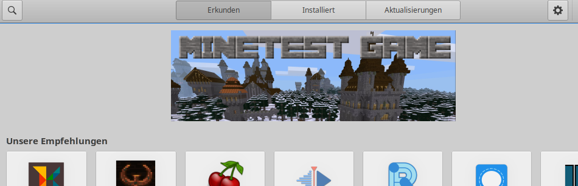
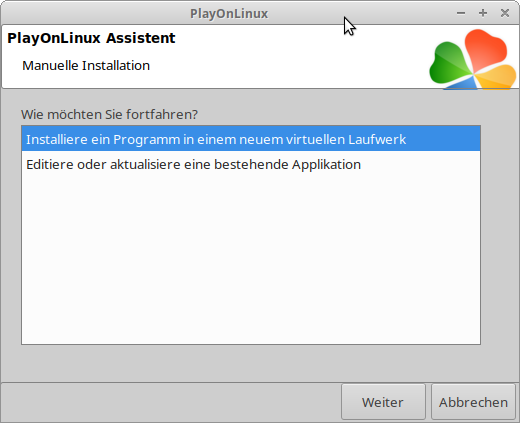

# Xubuntu 

Viele Computer der Computerspende-Regensburg sind mit dem System **Linux Xubuntu** 20.04
ausgestattet.

Linux ist nicht nur kostenlos, sondern bietet viele weitere Vorteile gegenüber Windows. Beispielsweise verlangt Linux wesentlich weniger Rechenleistung. 

Wir raten daher ausdrücklich davon ab, Windows 10 auf diesem Computer zu installieren, da die vorhandene Hardware dafür unter Umständen zu schwach ist und davon auszugehen ist, dass Windows 10, wenn überhaupt, nur sehr langsam arbeiten wird.

## Unterstützung

Xubuntu ist eine Variante von Ubuntu mit Xfce – Bildschirmoberfläche (daher **X**ubuntu).

Ubuntu wiederum basiert auf Debian.

Wenn Sie Unterstützung benötigen können Sie Sich an das Ubuntu – Wiki
oder das Ubuntu – Forum wenden. Die dortigen Ratschläge gelten in der
Regel auch für Xubuntu.

<http://www.ubuntuusers.de/> 

Wir empfehlen Ihnen außerdem unseren kostenlosen Rundbrief (per Mail) zu
abonnieren. Darin informieren wir über wichtige Neuerungen und geben
Tipps zu Ihrem Betriebssystem. Schicken Sie ggf. eine Mail an
<kontakt@computerspende-regensburg.de> *Auch Anregungen können Sie
gerne an diese Adresse richten\!

Bisher erschienene Rundbriefe und weitere Infos finden Sie auch auf
unserer Homepage: <http://www.computerspende-regensburg.de/>

Wenn Sie Sich gründlicher über Linux informieren wollen, empfehlen wir
diese Seite: <https://linuxjourney.com/> 

## Die wichtigsten Funktionen

### *Maus oder Touchpad:*

Die **linke **Maustaste startet Programme, öffnet Dokumente oder dient
zum Verschieben (Taste gedrückt halten). In der Regel reicht ein
**einfacher** Mausklick.

Die **rechte** Maustaste öffnet ein Auswahlfenster. Die jeweilige
Auswahl trifft man dann mit der linken Maustaste.

Klickt man beispielsweise in einen freien Bereich des Bildschirmes,
öffnet sich ein umfangreiches Auswahlfenster mit allen wichtigen
Anwendungen.

Wenn das Touchpad beim Tippen stört (ungewollte Aktionen auslöst), kann
es unter **Menü / Einstellungen / Maus und Touchpad** deaktiviert
werden. 

### Die Bildschirmleiste unten

ganz rechts:


Benutzer wechseln / Neustarten / Herunter fahren (= Ausschalten)

halb rechts


System und Anwendungen aktualisieren / Bluetooth – Adapter / Netzwerk
einrichten / Bildschirmhelligkeit / Lautstärke

halb links


Dateimanager / Internetbrowser / Mailprogramm / Bildschirmkamera /
Arbeitsflächenumschalter

ganz links


alle weiteren Anwendungsprogramme

Gilt immer:

Wenn Sie den Mauszeiger auf ein Anwendungssymbol setzen (ohne zu
klicken), erscheint ein entsprechender Erläuterungstext.

### externe Geräte

Wichtig\! Externe Geräte wie USB - Sticks oder externe Festplatten nicht
einfach abziehen, sondern vorher im Dateimanager durch Klick mit linker
Maustaste auf das Dreieck den Datenträger auswerfen. Andernfalls besteht
die Gefahr, dass der Datenträger gesperrt wird\!


## Computer individuell einrichten

### Benutzerkonten und Passwort verwalten

Unter **Menü / Einstellungen / Benutzer und Gruppen**

Aktuell ist auf diesem Rechner nur ein Benutzerkonto angelegt:

Name: Benutzer

Rechte: Administrator (kann wesentliche Änderungen am Rechner
durchführen).

Passwort: **albarello**

Sie benötigen das Passwort um zB. zusätzliche Software zu installieren.

Wenn der Computer von mehreren Personen benutzt wird, empfiehlt sich
auch die Anlage von

mehreren Benutzer-Konten.

Dabei können unterschiedliche Rechte vergeben werden:

**Administrator:** Kann alles verändern.

**Desktop – Benutzer:** Kann alle Programme benutzen, aber nichts
Wesentliches am Computer

verändern.

Jeder Benutzer erhält ein eigenes Verzeichnis für seine persönlichen
Daten und Einstellungen.


### Aussehen des Bildschirms anpassen

Leiste und Icons

Mit rechter Maustaste auf das Icon oder die Leiste klicken

Icons auf dem Bildschirm platzieren

Im Menü die gewünschte Anwendung suchen und darauf mit rechter Maustaste
klicken.

Hat man alles völlig verbogen

kann man unter **Menü / Einstellungen / Leistenprofile** frühere
Einstellungen wieder zurück holen.

Die ursprüngliche Konfiguration heißt „Computerspende-Regensburg“.

Diese Konfiguration kann auch exportiert und auf einen USB - Stick
kopiert werden. 

Hintergrundbild

Unter **Menü / Einstellungen / Schreibtisch**

Gefallen die hinterlegten Bilder nicht, kann man eigene Bilder in den
Ordner „Hintergrundbilder“ kopieren.

Weitere Möglichkeiten:


Dateimanager **Thunar **(auf dem Desktop links) öffnen.

Es genügt dann ein Klick mit** rechter** Maustaste auf ein Bild und
Auswahl:

Oder mit der rechten Maustaste in einen leeren Bereich des Bildschirms
klicken und mit linker Maustaste

*Schreibtischeinstellungen *wählen.

Sonstige Einstellungen

Unter **Menü / Einstellungen / Erscheinungsbild**

### Internet einrichten


Siehe in der Leiste: 

selbsterklärend

Grundsätzlich ist der Anschluss über ein LAN - Kabel an den Rooter die
beste Lösung.

Soll Wlan genutzt werden ist zu beachten:

Bei manchen Laptops muss das Wlan erst durch eine Tastenkombination oder
einen Schalter aktiviert werden\!

Fehlt dem PC eine Wlan - Karte, können USB - Wlan Sticks eingesetzt
werden.

Sogenannte Surfsticks können verwendet werden, jedoch sind nicht alle
Modelle Linux – kompatibel.

Eine weitere Möglichkeit ist Tethering über das Smartphone.

### Drucker und Scanner einrichten

Drucker installieren und überwachen unter **Menü / Einstellungen /
Drucker**

**Achtung:** Viele Drucker und Scanner erkennt Linux automatisch, es
existieren jedoch nicht für alle Geräte passende Treiber. Daher vor
einer Neuanschaffung durch Recherche im Internet oder eine Anfrage beim
Hersteller klären, ob das Gerät Linux - kompatibel ist. Muss ein Treiber
nachinstalliert werden, immer das Paket **.deb** wählen.

## Wichtige Anwendungen (bereits installiert)

### Dateien verwalten

**Thunar** (auf dem Desktop links)

Achtung\! Für das Löschen von Dateien und Ordern stehen zwei
Möglichkeiten zur Verfügung:

*Löschen* - Die Dateien werden vollständig entfernt.

*In den Papierkorb verschieben* - Die Dateien wandern in den Papierkorb
und bleiben dort erst einmal erhalten.

Vorteil: Hat man Dateien versehentlich gelöscht, können sie aus dem
Papierkorb wieder heraus geholt werden (in einen beliebigen Ordner
verschieben, oder Funktion „*wiederherstellen*“).

Nachteil: Dateien im Papierkorb belegen weiterhin Speicherplatz. Der
Papierkorb sollte daher regelmäßig geleert werden (Rechtsklick auf den
Papierkorb).

Wichtig: Verwenden sie die Funktion „*In den Papierkorb verschieben*“
auf einem Wechseldatenträger (USB - Stick, externe Festplatte), wird auf
diesem ein eigener Papierkorb angelegt, der ebenfalls regelmäßig geleert
werden muss. Wir empfehlen daher auf einem Wechseldatenträger die
Verwendung der Funktion *Löschen.*

**PCManFM** (in der Leiste links)

Bietet unter *Ansicht* einen *Dual-Fenster-Modus* zum einfachen Kopieren
von Dateien.

Daten auf der Festplatte werden hier beim Löschen automatisch in den
Papierkorb verschoben, auf einem Wechseldatenträger automatisch
gelöscht. Lässt sich unter *Bearbeiten / Einstellungen / Allgemein
*ändern.

**Meld **unter **Menü / Favoriten**

Ein kleines Programm zum Vergleichen von Ordnerinhalten oder auch
Texten. 

## Internet

Browser **Firefox **(Alternativen: Chromium, Falkon, Vivaldi, Opera)

Mailprogramm **Thunderbird **(sehr komfortabel)

Beide in der Leiste links

Kommunikation: **Skype **unter **Menü / Favoriten**

(wir empfehlen als unkomplizierte Alternative Jitsi, eine Anleitung
hierzu finden Sie auf unserer Homepage).

Fernwartung via Internet: **Teamviewer **unter** Menü / Favoriten**

### Bürosoftware

**Libre Office **unter **Menü / Favoriten und Büro**

Kompatibel mit MS – Office. Erstellte Dokumente können auch im MS –
Format gespeichert oder mit einem Klick in ein PDF – Dokument
umgewandelt werden. 

Alternative: Softmaker

### Bilder betrachten und bearbeiten

Eye of Mate

Zum schnellen Ansehen und Drehen von Bildern

**Gwenview **unter **Menü / Favoriten**

Bietet zusätzlich noch eine einfache Möglichkeit Bilder zurecht zu
schneiden

**Libre Office draw **unter **Menü / Büro**

Alternative: IrvanView

Alternativen für anspruchsvolle Bildbearbeitung: Rawtherapee und Gimp

## Audios und Videos abspielen

**Audacious **für Audios und Playlisten

**VlC Mediaplayer **spielt alles und kann auch laufende Videos
aufzeichnen / speichern

Beide unter **Menü / Multimedia**

****

### Zubehör

**Arbeitsflächenumschalter** (in der Leiste links)

Werden mehrere Anwendungen gleichzeitig geöffnet, können diese auf
unterschiedliche Arbeitsflächen verteilt werden. Dies erhöht die
Übersichtlichkeit. Anwendungen können auch zwischen verschiedenen
Arbeitsflächen hin und her geschoben werden.

**Bildschirmkamera** (in der Leiste links)

Erstellt ein Abbild des Bildschirms oder eines Bereichs davon,
beispielsweise als Memo. 

Fenster verschieben

Mit der linken Maustaste in die Fensterleiste oben klicken, Taste
gedrückt halten und Fenster
verschieben:

Fenster verkleinern oder vergrößern

Mauszeiger am Fensterrand positionieren bis das Pfeilsymbol erscheint,
dann linke Maustaste drücken und Fensterrand verschieben.


## Software installieren / deinstallieren

Mit dem **Snap Store** bzw. Softwarecenter unter **Menü / Favoriten /
Snap Store oder Software**



Alle angebotenen Programme sind in der Regel kostenlos\!

## Programme zuweisen

Soll eine Datei mit einem bestimmten Programm geöffnet werden:

Mit **rechter **Maustaste auf die Datei klicken und „Öffnen mit“
auswählen:

(mit linker Maustaste)


Soll die Anwendung dauerhaft zugewiesen werden:


## Dateistruktur

Die Linux – Dateistruktur ist sehr übersichtlich:

**Oberste Ebene** : root (Zeichen /)

Enthält alle Daten (System- und Nutzerdaten)

**darunter**: Home und Media

Im Home - Verzeichnis befinden sich alle Nutzerdaten, im Ordner Media
die externen Speichermedien (zB. USB-Stick).

Im Home - Verzeichnis

befindet sich für jeden Benutzer ein eigener Ordner, darin stehen dessen
persönliche Dateien.

Dateinamen mit vorangestelltem Punkt werden „versteckt“. Beispielsweise
befinden sich die System- und Nutzerdaten des Mailprogramms Thunderbird
im Order des jeweiligen Benutzers als Datei **.thunderbird**

Der vorliegende Rechner wurde so konfiguriert, dass sich Systemdateien
und Nutzerdaten (= Home) auf unterschiedlichen Partitionen befinden.
Dadurch kann ein neues Betriebssystem installiert werden, ohne dass die
vorhandenen Nutzerdaten überschrieben werden.

Wir empfehlen regelmäßig die persönlichen Daten zu sichern\!

Dazu kopieren Sie am einfachsten den gesamten persönlichen Ordner (hier:
benutzer) auf eine externe Festplatte.

Wenn Sie die Dateien und Ordner einzeln kopieren, vergessen Sie nicht
die unsichtbaren wie .thunderbird.

Linux bietet auch komfortable automatische Sicherungswerkzeuge an.

## Betriebssystem warten und upgraden

### Regelmäßig das Betriebssystem und die Anwendungsprogramme aktualisieren.


Das Symbol für die Aktualisierungsverwaltung finden sie in der Leiste
rechts.

> 

### Upgrade auf eine neue Version

Installiert ist eine Version mit Langzeitunterstützung (LTS). Diese
erhält 3 Jahre lang Aktualisierungen, Version 20 bis April 2023.

In jedem geraden Kalenderjahr wird eine neue LTS – Version heraus
gegeben.

Ein Upgrade auf eine neue Version läuft in der Regel automatisch, kann
aber auch leicht manuell durchgeführt werden, da das Betriebssystem (= /
bzw. /root) in einer eigenen Partition (üblicher Weise sda2) von den
Nutzerdaten (= /home) getrennt installiert wurde.

Weitere Infos siehe: [www.distrowatch.com](http://www.distrowatch.com/)
oder wenden Sie sich an uns.

### Sprachunterstützung

Sind beispielsweise durch eine Softwareaktualisierung Sprachpakete
verloren gegangen (der Computer spricht mehr Englisch als Deutsch),
können diese automatisch nachinstalliert werden. Siehe hierzu unter**
Menü / Einstellungen / Sprachen**

### Unnötige Systemdateien löschen mit Bleach Bit

Unter **Menü / Favoriten**

Dadurch wird der Computer von unnötigem Ballast befreit und arbeitet
wieder schneller.

Die zu löschenden Dateien können durch das Setzen der entsprechenden
Häkchen ausgewählt werden.

Wir empfehlen nachfolgende Auswahl. Anschließend können durch einen
Klick auf das Symbol „Bereinigen“ im Fenster oben die Dateien gelöscht
und dadurch Speicherplatz freigegeben werden.


Eine weitere Möglichkeit um überzählige Paketdateien zu entfernen ist
die Eingabe des Befehls

sudo apt autoremove

in ein Terminal. Beachten: Bei der Passworteingabe erscheint keine
Anzeige, einfach drauf los schreiben.

## Tipps für ein effektives Arbeiten

Um die Leistungsfähigkeit Ihres Computers optimal zu nutzen empfehlen
wir:

  - Achten Sie darauf, Programme nicht mehrfach zu starten,
    beispielsweise durch einen versehentlichen Doppelklick. Dies gilt
    besonders für Programme wie Internetbrowser oder Bildbearbeitung.
  - Schließen Sie Programme, die sie nicht mehr benötigen.
  - Öffnen Sie im Internetbrowser nicht zu viele Fenster gleichzeitig.
  - Löschen Sie im Internetbrowser regelmäßig Cookies, Verlauf und
    temporäre Dateien (im Firefox unter *Menü / Einstellungen /
    Datenschutz & Sicherheit / Cookies und Website-Daten*). Sie können
    dazu auch das Programm Bleach Bit verwenden.
  - Leeren Sie regelmäßig den Papierkorb.
  - Schließen Sie einen Laptop mit dem Netzgerät an das Stromnetz an.
  - Ein Internetanschluss per LAN - Kabel arbeitet in der Regel
    schneller als per WLAN

## Externe Software installieren / deinstallieren

### Über das Terminal

unter Menü / Zubehör / Terminal

Befehl für das Installieren eines Programms:

```
sudo apt-get install *Programmname*
```

Befehl für das Löschen eines Programms:

```
sudo apt-get purge* Programmname*
```

Achtung: Die Eingabe das Passwortes erfolgt ohne Anzeige, einfach Cursor
in das Terminalfeld setzten und mutig drauf los schreiben.

##  Als Paket das man sich zuvor aus dem Internet geladen hat

Erforderlich sind Pakete für Debian (oder Ubuntu) in 64 oder 32 bit,
also:

Paketname**.deb**

Rechter Mausklick auf das Paket und als Anwendung** **beispielsweise**
Gdebi – Paketinstallationsprogramm **wählen.

## Windows / Microsoft Programme nutzen

Diese (Dateiname**.exe**) sind grundsätzlich nur über die Software Wine
oder in einer virtuellen Maschine (zB. Virtual box) installierbar. Wir
empfehlen daher möglichst Programme aus der Linux – Welt zu verwenden.

I**nstallation mit Wine**

Erst muss die Software Wine selbst installiert werden, am einfachsten
über das Softwarecenter:

Menü / Favoriten / Software


Wer nicht gerne mit dem Terminal arbeitet, installiert dazu gleich die
grafische Oberfläche PlayOnLinux.


Windows / MSDOS Programm installieren

Windows / MSDOS Programmdatei in einen beliebigen Ordner kopieren.

PlayOnLinux starten (Menü / System / PlayOnLinux)


Eventuell findet man das gewünschte Programm in einer der Kategorien in
der oberen Auswahlleiste. Ansonsten siehe roter Kreis.




Hier einen beliebigen Namen für die neue Anwendung eingeben und die
zuvor abgespeicherte Installationsdatei auswählen.


Es startet der übliche Windows-Installationsprozess.
